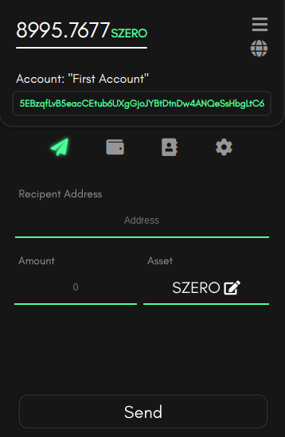
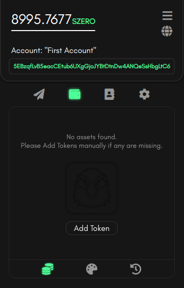

# Vulture's Vision
The vulture: an animal I know essentially nothing about! I basically conjured the name [Vulture wallet](https://vulturewallet.net) out of thin air; that being said
it is one of the projects that I spend quite a lot of my time thinking about.

I'd like to write about some ideas I've had, as well as some of the key points
I keep in mind when I work on the Vulture wallet project.

*Anyone reading this post may or may not get some tips about sleek front-end design
as well as programming. :p*

## Front-End & Stories
Here are some poorly cropped samples of the Vulture-extension front-end:

    
    

These pics show that the idea with the front-end is minimalism, I'm personally aiming
for a style that resonates with me; which is no bs. Every piece of information the
UI shows is supposed to have a very specific task & should perform said task in a
clean and cohesive manner.

In other words: *I want no bs.*

Still a ways to go, I know...

The wallet is heavily color-coded, since Vulture is multi-chain I've decided to let the user pick a color for each network, which will be reflected when the user selects said network.

Aleph Zero and it's test-networks are a nice & fresh minty green, Polkadot & Kusama are a nice & neon hot pink.

*Ps: Vulture doesn't allow custom substrate-chains the moment of writing this blog, and the available chains are hard-coded. This will remain the case until all chains allow for hardware-wallet ledger support.*

I see no point in following rules and schemes for front-end design, I simply draw something or visualize it; and if it resonates with me I'll code it all into a front-end framework! Whether it's web-based, native, or my own.

Speaking of which, Vulture uses Vue. Before Vulture I was quite intensively working on another wallet which was specifically made for Avalanche, dark days it was...
I called this project, Metro...

*Story time?*

At first I used React, and then used Angular *(and stuck with angular)*. After a
while of coding Metro and using Metro I had quite an epiphany...

Ira realized that they wanted to use a multi-chain wallet! But metro would require
a hard rewrite to support multichain! :(

After having used React and Angular I decided to try out Vue to complete the trifecta; it was a good decision.

Vue > Angular > React.

Anyhow, I decided to design Vulture in a very abstract manner from the get-go; I should be able to
swap systems left and right should the situation require that!

Along with using the project as a way to learn Vue 3 i've also been aware of a new and interesting blockchain project called Aleph Zero.

Aleph zero is a blockchain project that's based on the Substrate framework, it has a
novel consensus algorithm based on HoneybadgerBFT called AlephBFT.

I decided to learn Substrate & its APIs since I was curious, and use that knowledge to make the first set of chains that my new wallet project supports be Substrate
chains!

*One of* The best parts about Substrate is that it's Rust-based, even the Js API is mainly
using WASM compiled from Rust *(which was a pain to use with extensions, but I'll skip that part).*

Subsequently, I started working on Vulture... The project is now at V0.1.5-beta, with the next version containing lots of fancy smart contract features!

I mentioned Rust, WASM, and Substrate; so I'm gonna switch the subject from front-end to back-end (no jokes pls).

## Back-End & Stores
The back-end code for Vulture is split from the Front-end code and has quite a lot
of "abstraction layers" that allow me to make backend changes frequently without a need to worry about UI breaking; it also cleans the code up quite a bit *(although some refactoring is still needed at this early stage :p).*

Abstraction layers essentially means the use of interfaces & polymorphism to
create a system where code changes don't ripple along the entire application
in unpredictable ways *(as long as the code is functional :p)*.

An abstract `Network` interface/class for instance, could be used to represent
any arbitrary decentralized network; whether it's EVM based or Substrate based.

This interface would contain the necessary information & functions to interact
with any network.

The front-end uses the interface and it's up to the implementation of the interface to handle the network specific stuff!

It's OOP 101, I know; but I'm not gonna assume any knowledge ;p

Anyways, Vulture can be upgraded and modified in an easier manner than Metro! Goal has been accomplished!

*now I just need to do the upgrading and implementation...*

## Usecases & Important points
Vulture is Open source and Non-custodial. This is extremely important; I wouldn't use any wallet that doesn't have those features. There's plenty of nice multi-chain wallets, but I haven't seen any that have a nice mix of sleek UI *that resonates with me personally :p*, Open-source & non-custodial, and multi-chain.

Obviously if I want something so specific I should make it myself; which I am...

After v0.1.5-beta of Vulture I've got some key features that I'll be working on which will make use of other wallets quite redundant for me.

### Vulture Dashboard
You'll be able to open the wallet in a full page/tab; along with the current extension view!

This will reveal a dashboard with a more information-full page; one where all the networks the wallet has aren't seperated, and you can get a view of your entire portfolio, transactions, and services (like staking).

I won't include and sneak-peaks of the dashboard yet; but it's a feature that I won't include until the wallet gets hardware wallet support.

The Web browser environment is simply not safe enough for my own standards; There's a reason I never cache the private keys of the wallet and require the
user to write the password on essentially every action; it sucks but is necessary.

### Dapp Browser & Integrated Dapps
With smart-contracts comes decentralized applications! Having a in-wallet browser for them would be really neat, as well as having integrated services such as
asset-swapping, bridges, and general features!

Since you essentially create feature-specific chains with Substrate and Avalanche Subnets, there has to be a way
to integrate said chains into the wallet!

These things aren't novel, most state-of-the art wallets contain them! But they're all closed source! >;(

### Cross-Platformness
Quite a nobrainer, need to be able to use Vulture on mobile! Having a native application would also be nice! But I'd like to reserve that to be part of my own
UI framework that I'll likely create, rust-based ofc :D

## Ending Remarks
A wallet, or Interface as I like to call them is a tool; a utility! I want to create one that I can use for my own future blockchain-related projects!

I also want one where anyone can contribute and learn from; We've got a ways to
go, and I'll be quite happy to see what happens with vulture by the end of 2022; where hopefully the above features are all implemented!

Farewell, for now~

